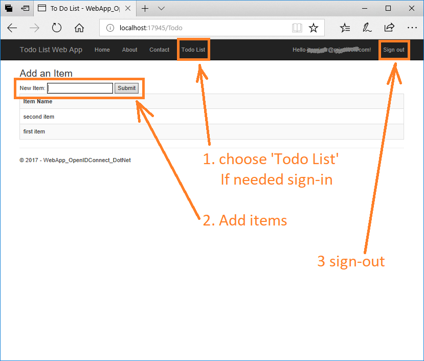

# Calling a web API in an ASP.NET Core web application using Azure AD
## About this sample
### Scenario
This sample contains a web API running on ASP.NET Core 2.0 protected by Azure AD. The web API is accessed by an ASP.NET Core 2.0 web application on behalf of the signed-in user. The ASP.NET Web application uses the OpenID Connect middleware and the Active Directory Authentication Library (ADAL.NET) to obtain a JWT bearer token for the signed-in user using the [OAuth 2.0](https://docs.microsoft.com/en-us/azure/active-directory/develop/active-directory-protocols-oauth-code) protocol. The bearer token is passed to the web API, which validates the token and authorizes the user using the JWT bearer authentication middleware.

### More information
For more information about how the protocols work in this scenario and other scenarios, see [Authentication Scenarios for Azure AD](http://go.microsoft.com/fwlink/?LinkId=394414).

> This sample has been updated to ASP.NET Core 2.0. Looking for previous versions of this code sample? Check out the tags on the [ASP.NET Core 1.0](../../tree/aspnet10) branch.

> This sample is for Azure AD v1.0. If you are looking for an Azure AD v2.0 sample (to sign-in users with Work and School accounts **and Microsoft Personal accounts**, please look at [active-directory-aspnetcore-webapp-openidconnect-v2](https://github.com/Azure-Samples/active-directory-aspnetcore-webapp-openidconnect-v2)

### User experience
The web API, **TodoListService**, maintains an in-memory collection of to-do items per authenticated user. The authenticated user carries the same to-do list across multiple instances of the web app in this sample as well as native clients like the [.NET native (WPF) client](https://github.com/Azure-Samples/active-directory-dotnet-native-aspnetcore).

The ASP.NET Core 2.0 web app, **TodoListWebApp** enables a user to:
- Sign in. The first time a user signs in, a consent screen prompts the user for permission to access **TodoListService** and obtain user profile information from Azure Active Directory. Since this is a web app, hosted in a browser, it can be that the user gets immediately signed-in benefiting from Single Sign On with other web applications. 
- Select **Todo List** in the app's navigation bar. The user may then:
    - See the list of to-do items exposed by Web API for the signed-in identity,
    - Add more to-do items (buy clicking on Add item).
- Sign out.

On subsequent returns to the web app, the user's session is persisted locally in a cookie and reauthentication is not required.



## Running the sample

> [!NOTE] 
> If you want to run this sample on **Azure Government**, see the "Azure Government Deviations" section at the bottom of this page.


### Pre-requisites

- [.NET Core for Windows](https://www.microsoft.com/net/learn/get-started/windows#windows)
- [Visual Studio 2017](https://aka.ms/vsdownload)
- An [Azure Active Directory (Azure AD) tenant](https://azure.microsoft.com/documentation/articles/active-directory-howto-tenant/)
- A [user account in the Azure AD tenant](https://docs.microsoft.com/azure/active-directory/add-users-azure-active-directory) This sample will not work with a Microsoft account (formerly Windows Live account).

### Step 1: Clone or download this repository

From your shell or command line:

```sh
git clone https://github.com/Azure-Samples/active-directory-dotnet-webapp-webapi-openidconnect-aspnetcore.git
```

### Step 2:  Register the sample application with your Azure Active Directory tenant

There are two projects in this sample. Each needs to be separately registered in your Azure AD tenant. To register these projects, you can:

- either follow the steps [Step 2: Register the sample with your Azure Active Directory tenant](#step-2-register-the-sample-with-your-azure-active-directory-tenant) and [Step 3:  Configure the sample to use your Azure AD tenant](#choose-the-azure-ad-tenant-where-you-want-to-create-your-applications)
- or use PowerShell scripts that:
  - **automatically** creates the Azure AD applications and related objects (passwords, permissions, dependencies) for you
  - modify the Visual Studio projects' configuration files.

If you want to use this automation:

1. On Windows, run PowerShell and navigate to the root of the cloned directory
1. In PowerShell run:

   ```PowerShell
   Set-ExecutionPolicy -ExecutionPolicy RemoteSigned -Scope Process -Force
   ```

1. Run the script to create your Azure AD application and configure the code of the sample application accordingly.
1. In PowerShell run:

   ```PowerShell
   .\AppCreationScripts\Configure.ps1
   ```

   > Other ways of running the scripts are described in [App Creation Scripts](./AppCreationScripts/AppCreationScripts.md)

1. Open the Visual Studio solution and click start to run the code.

If you don't want to use this automation, follow the steps below.

#### Choose the Azure AD tenant where you want to create your applications

As a first step you'll need to:

1. Sign in to the [Azure portal](https://portal.azure.com) using either a work or school account or a personal Microsoft account.
1. If your account is present in more than one Azure AD tenant, select your profile at the top right corner in the menu on top of the page, and then **switch directory**.
   Change your portal session to the desired Azure AD tenant.

#### Register the service app (TodoListService-aspnetcore)

1. Navigate to the Microsoft identity platform for developers [App registrations](https://go.microsoft.com/fwlink/?linkid=2083908) page.
1. Select **New registration**.
1. When the **Register an application page** appears, enter your application's registration information:
   - In the **Name** section, enter a meaningful application name that will be displayed to users of the app, for example `TodoListService-aspnetcore`.
   - Change **Supported account types** to **Accounts in any organizational directory**.
   - In the Redirect URI (optional) section, select **Web** in the combo-box and enter the following redirect URIs: `https://localhost:44351/`.
1. Select **Register** to create the application.
1. On the app **Overview** page, find the **Application (client) ID** value and record it for later. You'll need it to configure the Visual Studio configuration file for this project.
1. Select the **API permissions** section
   - Click the **Add a permission** button and then,
   - Ensure that the **Microsoft APIs** tab is selected
   - In the *Commonly used Microsoft APIs* section, click on **Microsoft Graph**
   - In the **Delegated permissions** section, ensure that the right permissions are checked: **User.Read**. Use the search box if necessary.
   - Select the **Add permissions** button

1. Select the **Expose an API** section, and:
   - Select **Add a scope**
   - Accept the proposed Application ID URI (api://{clientId}) by selecting **Save and Continue**
   - Enter the following parameters
     - for **Scope name** use `user_impersonation`
     - Keep `Admins and users` for **Who can consent**
     - in **Admin consent display name** type `Access TodoListService-aspnetcore as a user`
     - in **Admin consent description** type `Accesses the TodoListService-aspnetcore Web API as a user`
     - in **User consent display name** type `Access TodoListService-aspnetcore as a user`
     - in **User consent description** type `Accesses the TodoListService-aspnetcore Web API as a user`
     - Keep **State** as `Enabled`
     - Select **Add scope**

#### Register the client app (TodoListWebApp-aspnetcore)

1. Navigate to the Microsoft identity platform for developers [App registrations](https://go.microsoft.com/fwlink/?linkid=2083908) page.
1. Select **New registration**.
1. When the **Register an application page** appears, enter your application's registration information:
   - In the **Name** section, enter a meaningful application name that will be displayed to users of the app, for example `TodoListWebApp-aspnetcore`.
   - Change **Supported account types** to **Accounts in any organizational directory**.
     > Note that there are more than one redirect URIs. You'll need to add them from the **Authentication** tab later after the app has been created successfully.
1. Select **Register** to create the application.
1. On the app **Overview** page, find the **Application (client) ID** value and record it for later. You'll need it to configure the Visual Studio configuration file for this project.
1. From the app's Overview page, select the **Authentication** section.
   - In the Redirect URIs section, select **Web** in the combo-box and enter the following redirect URIs.
       - `https://localhost:44377/`
       - `https://localhost:44377/signin-oidc`
   - In the **Advanced settings** section set **Logout URL** to `https://localhost:44371/Account/EndSession`
   - In the **Advanced settings** | **Implicit grant** section, check **ID tokens** and **Access Tokens** as this sample requires
     the [Implicit grant flow](https://docs.microsoft.com/en-us/azure/active-directory/develop/v2-oauth2-implicit-grant-flow) to be enabled to
     sign-in the user, and call an API.
1. Select **Save**.
1. From the **Certificates & secrets** page, in the **Client secrets** section, choose **New client secret**:

   - Type a key description (of instance `app secret`),
   - Select a key duration of either **In 1 year**, **In 2 years**, or **Never Expires**.
   - When you press the **Add** button, the key value will be displayed, copy, and save the value in a safe location.
   - You'll need this key later to configure the project in Visual Studio. This key value will not be displayed again, nor retrievable by any other means,
     so record it as soon as it is visible from the Azure portal.
1. Select the **API permissions** section
   - Click the **Add a permission** button and then:
   - Ensure that the **My APIs** tab is selected
   - In the list of APIs, select the API `TodoListService-aspnetcore`.
   - In the **Delegated permissions** section, ensure that the right permissions are checked: **user_impersonation**.
   - Select the **Add permissions** button.

#### Configure authorized client applications for service (TodoListService-aspnetcore)

For the middle tier web API (`TodoListService-aspnetcore`) to be able to call the downstream web APIs, the user must grant the middle tier permission to do so in the form of consent.
However, since the middle tier has no interactive UI of its own, you need to explicitly bind the client app registration in Azure AD, with the registration for the web API.
This binding merges the consent required by both the client and middle tier into a single dialog, which will be presented to the user by the client.
You can do so by adding the "Client ID" of the client app, to the manifest of the web API in the `knownClientApplications` property. Here's how:

1. In the [Azure portal](https://portal.azure.com), navigate to your `TodoListService-aspnetcore` app registration, and in the **Expose an API** section, click on **Add a client application**.
   Input the client ID of the client application (`TodoListWebApp-aspnetcore`) and check **user_impersonation** for authorized scopes.
1. Click **Add application**

### Step 3:  Configure the sample to use your Azure AD tenant

In the steps below, "ClientID" is the same as "Application ID" or "AppId".

Open the solution in Visual Studio to configure the projects

#### Configure the service project

> Note: if you used the setup scripts, the changes below will have been applied for you

1. Open the `TodoListService\appsettings.json` file
1. Find the app key `Domain` and replace the existing value with your Azure AD tenant name.
1. Find the app key `TenantId` and replace the existing value with your Azure AD tenant ID.
1. Find the app key `ClientId` and replace the existing value with the application ID (clientId) of the `TodoListService-aspnetcore` application copied from the Azure portal.

#### Configure the client project

> Note: if you used the setup scripts, the changes below will have been applied for you

1. Open the `TodoListWebApp\appsettings.json` file
1. Find the app key `Domain` and replace the existing value with your Azure AD tenant name.
1. Find the app key `TenantId` and replace the existing value with your Azure AD tenant ID.
1. Find the app key `ClientId` and replace the existing value with the application ID (clientId) of the `TodoListWebApp-aspnetcore` application copied from the Azure portal.
1. Find the app key `ClientSecret` and replace the existing value with the key you saved during the creation of the `TodoListWebApp-aspnetcore` app, in the Azure portal.
1. Find the app key `TodoListResourceId` and replace the existing value with `api://{TodoListService_ClientId}`.

### Step 4: Run the sample

In the solution properties, set both projects as startup projects. Set **TodoListService** to run first. Clean the solution, rebuild it, and then run it.  

On startup, the web API displays an empty web page. This is expected behavior.

Explore the sample by signing in into the web app, clicking on "Todo List", signing again if needed, adding items to the To Do list, signing-out, and starting again.  Since the authenticated session is stored in a cookie, the application doesn't require logging in again if the previous session was never signed out.

> [!NOTE]
> The To Do list is stored in memory in this sample. Each time the TodoListService API is stopped, any to-do lists are reset.

## How was the code created?
### Code for the service
The code for the service is exactly the same as the service used in the [active-directory-dotnet-native-aspnetcore](https://github.com/Azure-Samples/active-directory-dotnet-native-aspnetcore#how-the-code-was-created) sample. Please refer to that sample for more information.

### Code for ASP.NET Web App
The code for the ASP.NET web app is based on the code of the [active-directory-dotnet-webapp-openidconnect-aspnetcore](https://github.com/Azure-Samples/active-directory-dotnet-webapp-openidconnect-aspnetcore) sample. Please read the "About The code" section of that sample first.

Then, based on that code, the following modifications were applied. [This commit](https://github.com/Azure-Samples/active-directory-dotnet-webapp-webapi-openidconnect-aspnetcore/pull/24/commits/2ce2750dfd172f9297c2d1885cccdd6b66cc7529) details the incremental changes described below:
- Update of the AzureAdOptions class to add a property to compute the `Authority` from the `instance` and the `tenantID`, and adding two other configuration options for `ClientSecret`,  the `resourceId` of TodoListService (its clientId) and the base address for this service.
- Added a `TodoListItem` in models to deserialize the Json sent by the TodoListService
- Added a `NaiveSessionCache` class in a new Utils folder which serves as a token cache which livetime is the duration of the session. Updated the `Startup.cs` file accordingly to add sessions.
- Added a `TodoListController` and a `Todo` view, as well as a "Todo List" entry in the toolbar of the Web API. This is where most of the interesting code is
- Updated the `SignOut()` method of the `AccountController` to clear the cache for the user when s/he signs-out.
- Updated `AzureAdAuthenticationBuilderExtensions.cs` to request an authorization code, and redeem it, getting an access token to the Azure AD graph (`https://graph.windows.com`), so that the token cache contains a token for the user. This token will be used by the `TodoController` to request another token for the TodoListService

This scenario is slightly different than the same scenario in ASP.NET (not Core).  Note the following line in *AzureAdAuthenticationBuilderExtensions.cs*:

```csharp
options.ResponseType = "id_token code";
```

Unlike ASP.NET, ASP.NET Core 2.0 uses an implicit flow by default. Without overriding the response type (default *id_token*), the `OnTokenValidated` event is fired instead of `OnAuthorizationCodeReceived`. The line above requests **both** *id_token* and *code*, so that `OnTokenValidated` is called first. This ensures that `context.Principal` has a non-null value representing the signed-in user when `OnAuthorizeationCodeReceived` is called.

### How to change the app URL
If you are using Visual Studio 2017
1. Edit the TodoListService's properties (right click on `TodoListService.csproj`, and choose **Properties**)
1. In the Debug tab:
    1. Check the **Launch browser** field to `https://localhost:44351/api/todolist`
    1. Change the **App URL** field to be `https://localhost:44351` as this is the URL registered in the Azure AD application representing our Web API.
    1. Check the **Enable SSL** field

The same kind of modifications can be made on the `TodoListWebApp.csproj` project.

> [!WARNING]
> Ensure that all of the app registration steps reflect any changes made to the URLs, or the sample won't function.

### What to change when you deploy the sample to Azure
To this sample to Azure:
- Update the various URLs (reply URLs, Base URL) in the *appsettings.json* files
- Add Reply URLs pointing to the deployed location, for  both applications in the Azure portal

### Azure Government Deviations

In order to run this sample on Azure Government you can follow through the steps above with a few variations:

- Step 2: 
   - You must register this sample for your AAD Tenant in Azure Government by following Step 2 above in the [Azure Government portal](https://portal.azure.us). 
- Step 3: 
    - Before configuring the sample, you must make sure your [Visual Studio is connected to Azure Government](https://docs.microsoft.com/azure/azure-government/documentation-government-get-started-connect-with-vs).     
    - Navigate to the appsettings.json files for both the TodoListService web API and TodoListWebApp web application. Replace the "Instance" property in the Azure AD section with `https://login.microsoftonline.us/`. 
    
Once those changes have been accounted for, you should be able to run this sample on Azure Government.


## Related content
### Other documentation / samples
The scenarios involving Azure Active directory with ASP.NET Core are described in ASP.Net Core | Security | Authentication | [Azure Active Directory](https://docs.microsoft.com/en-us/aspnet/core/security/authentication/azure-active-directory/). From this page, you can access the related samples
